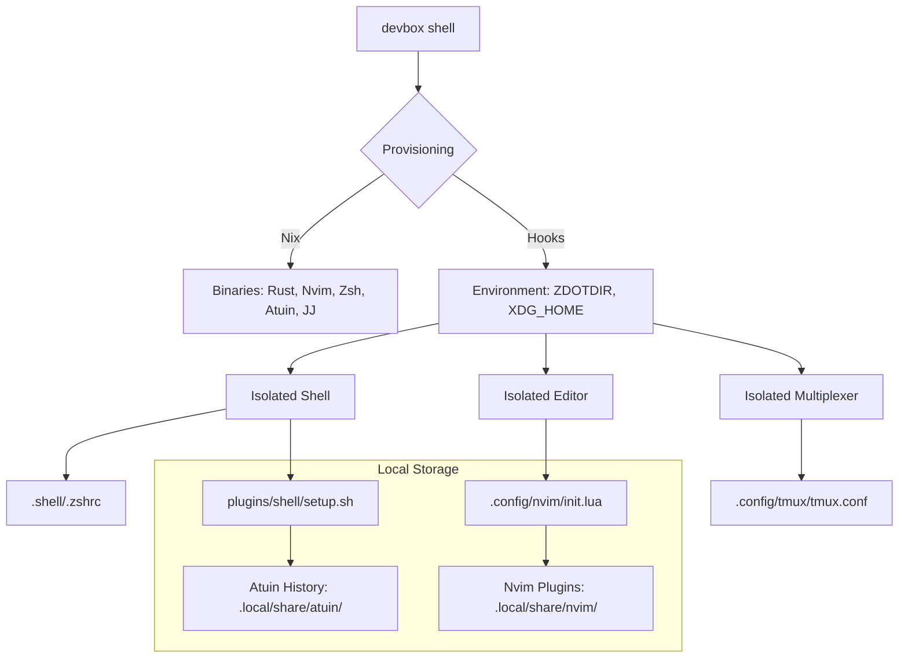

# 🚀 Portable isolated Devbox Environment

A fully isolated, reproducible development environment built on [Devbox](https://www.jetpack.io/devbox) and Nix. This project virtualizes your entire shell and editor experience—allowing you to work with a "premium" toolchain (Rust, NeoVim, Zsh, Tmux, Atuin) without installing a single thing on your host system or modifying your `~/.zshrc`.

---

## 🏗 Architecture & Isolation

This project uses a "Zero-Pollution" philosophy. It doesn't just install tools; it re-routes their configuration to stay entirely within this directory.



> [!TIP]
> **Total Isolation:** By overriding `ZDOTDIR` and `XDG_CONFIG_HOME`, we force tools like Zsh and NeoVim to ignore your system global configs. When you `exit`, your host machine remains exactly as it was.

---

## 🧰 The Toolchain

### 🦀 Core Development
- **Rust Toolchain**: Latest stable `rustc`, `cargo`, and `rust-analyzer`.
- **Jujutsu (jj)**: A next-generation version control system used alongside Git for a superior workflow.
- **Node.js & Python**: Standard runtimes for auxiliary scripts and editor plugins.

### 🐚 The "Premium" Shell
A Zsh environment that looks and feels identical on macOS, Linux, or WSL.
- **Starship Prompt**: High-performance, contextual prompt.
  - **Compatibility Mode**: If icons look like boxes, set `export DEVBOX_NO_NERD_FONTS=1` to use the ASCII-only prompt.
  - **Native Fallback**: If Starship fails to load, the shell automatically reverts to a robust, color-coded native Zsh prompt.
- **Atuin**: Replace `Ctrl-R` with a powerful, searchable UI for your project history.
- **Syntax Highlighting**: Real-time highlighting as you type.
- **Isolated History**: Commands run here stay here—stored in `.local/share/atuin/`.

### 📝 NeoVim IDE
- **LazyVim Base**: A heavily optimized, modern IDE experience.
- **Self-Bootstrapping**: Installs plugins and LSP servers automatically on the first run inside the project folder.

### ⚡ Modern CLI Utilities
Modern, faster replacements for standard Unix tools:
- **`bat`**: `cat` with syntax highlighting and Git integration.
- **`fzf`**: Blazing fast fuzzy finder.
- **`rg` (ripgrep)**: The fastest way to search code.
- **`fd`**: A user-friendly alternative to `find`.
- **`lazygit`**: A terminal UI for complex Git operations.

---

## 🤖 Gemini Agent Integration

If you are using this environment with the Gemini Agent, you can use the following shorthand:

*   **"let's do version control"**: Automatically synchronizes Git and Jujutsu. The agent will check statuses, diffs, and propose a unified commit message for both systems.

---

## 🚀 Quick Start

### 1. Install Devbox
```bash
curl -fsSL https://get.jetpack.io/devbox | bash
```

### 2. Clone and Enter
```bash
# Clone the repository
git clone https://github.com/bubbaaz/devbox.git
cd devbox

# Launch the environment
devbox shell
```

> [!IMPORTANT]
> The first time you run `devbox shell`, it will download all tools and bootstrap NeoVim. This might take a few minutes depending on your internet speed. Subsequent starts are near-instant.

### 3. Exit
Simply type `exit` to return to your normal host shell.

---

## 🔧 Troubleshooting


*   **Strange characters or boxes?** This usually means your terminal doesn't have a [Nerd Font](https://www.nerdfonts.com/) installed. You can fix this by running `export DEVBOX_NO_NERD_FONTS=1` before (or inside) the shell to switch to the simplified ASCII prompt.

*   **Prompt not loading?** Run `exit` and `devbox shell` again. We force `TERM=xterm-256color` to ensure compatibility. If Starship continues to fail, the shell will automatically use its native Zsh fallback prompt.

*   **Where is my history?** History is managed by Atuin in `.local/share/atuin/history.db`.
