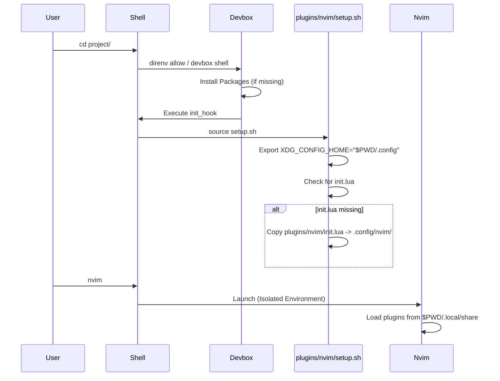

# Devbox Development Environment

This project uses [Devbox](https://www.jetpack.io/devbox) to create a reproducible, portable, and isolated development environment. It features a custom **Project-Local NeoVim** setup, ensuring that your editor configuration is consistent and contained entirely within this directory.

## 🏗 Architecture

The project is split into two main responsibilities: **Provisioning** (installing tools) and **Configuration** (setting them up).

```mermaid
graph TD
    subgraph "Provisioning (devbox.json)"
        Devbox[Devbox] -->|Installs| Packages[Packages\n(neovim, git, nodejs, etc.)]
        Devbox -->|Includes| Plugin[plugins/nvim/plugin.json]
    end

    subgraph "Configuration (plugins/nvim/)"
        Plugin -->|Defines| Hooks[Shell Hooks & Scripts]
        Hooks -->|Executes| Setup[setup.sh]
        Setup -->|Sets| EnvVars[XDG Environment Vars]
        Setup -->|Deploys| Config[init.lua]
    end

    EnvVars -->|Isolates| Nvim[NeoVim Instance]
    Config -->|Configures| Nvim
```

### 1. `devbox.json` (The Provisioner)
Located at the project root, this file defines the **tools** required for the project.
- **Packages**: Lists `neovim`, `git`, `ripgrep`, `nodejs`, etc.
- **Includes**: Imports `./plugins/nvim/plugin.json` to bring in the NeoVim-specific logic.

### 2. `plugins/nvim/` (The Configurator)
This directory acts as a local Devbox plugin. It encapsulates all the logic needed to verify and configure the editor.
- **`plugin.json`**: Defines shell hooks (`init_hook`) and convenience scripts (`nvim-health`).
- **`setup.sh`**: Runs when you enter the shell. It:
    1.  Sets `XDG_CONFIG_HOME` and `XDG_DATA_HOME` to local folders (`.config/`, `.local/`).
    2.  Ensures required directories exist.
    3.  Copies the bootstrap `init.lua` if it's missing.
- **`init.lua`**: The entry point for the NeoVim configuration (bootstrapping `lazy.nvim` and `LazyVim`).

## 🚀 How It Works

When you enter the directory (via `cd` with `direnv` or `devbox shell`), the following sequence occurs:



## 🛠 Usage

### Prerequisites
- [Devbox](https://www.jetpack.io/devbox/docs/installing_devbox/)
- [Direnv](https://direnv.net/) (Recommended)

### Quick Start
1.  **Clone the repo** and `cd` into it.
2.  **Initialize**:
    ```bash
    devbox install
    direnv allow  # If using direnv
    # OR
    devbox shell
    ```
3.  **Run NeoVim**:
    ```bash
    nvim
    ```
    You will see LazyVim install plugins into `.local/share/nvim`. Nothing is touched in your global home directory.

### Scripts
The plugin provides helper scripts accessible via `devbox run`:

- `devbox run nvim-health`: Checks the health of the environment and verifies configuration.
- `devbox run nvim-update`: Updates plugins headless.
